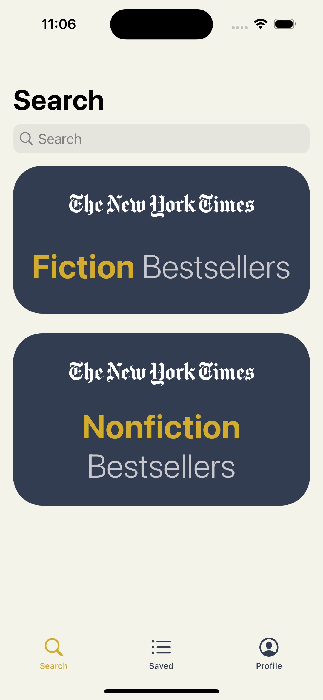
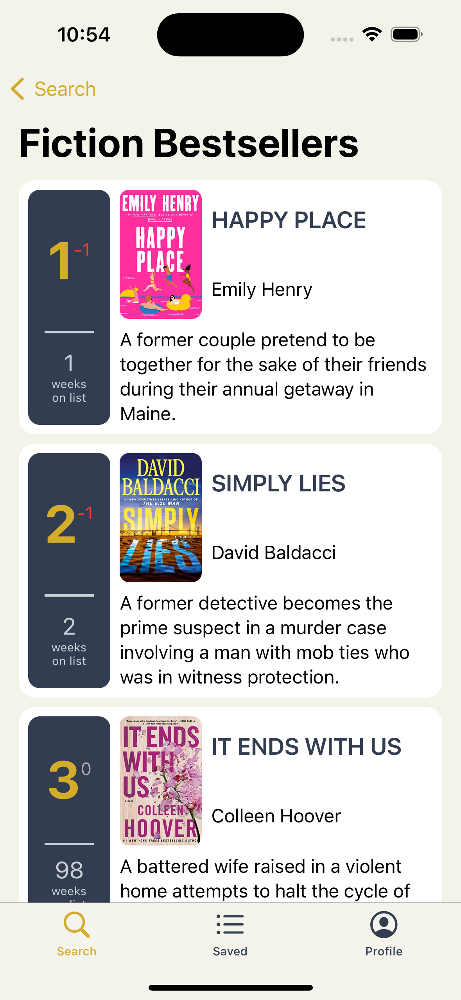
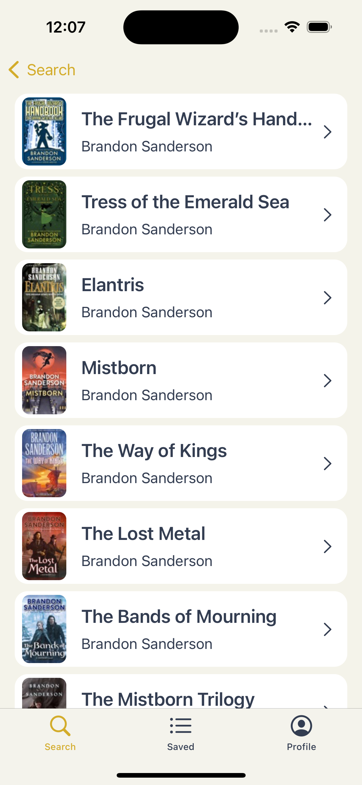
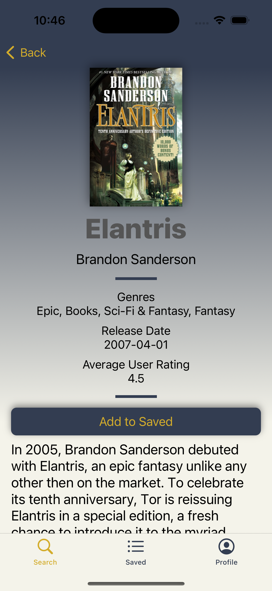
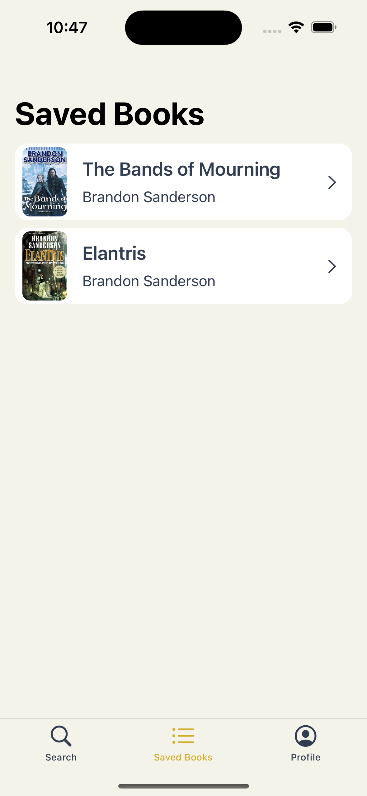

# Bibliotheque
Bibliotheque is a simple app which allows users to explore new books, add them to reading list and then mark them as read when they are finished.

To find their next book, user can either check New York Times Bestseller list:

  

or simply search by author or title:

 

Saved books appears in Saved tab. User also has a possibility to keep track of books that are currently saved and ones that have been read.

 
